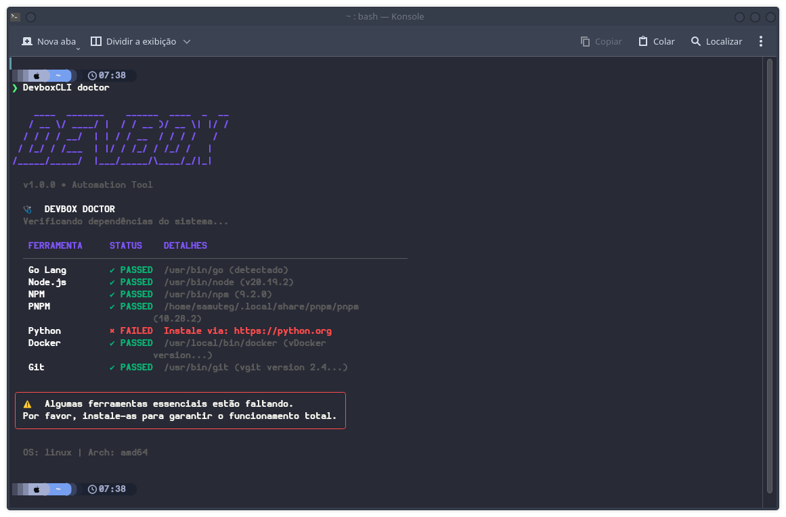
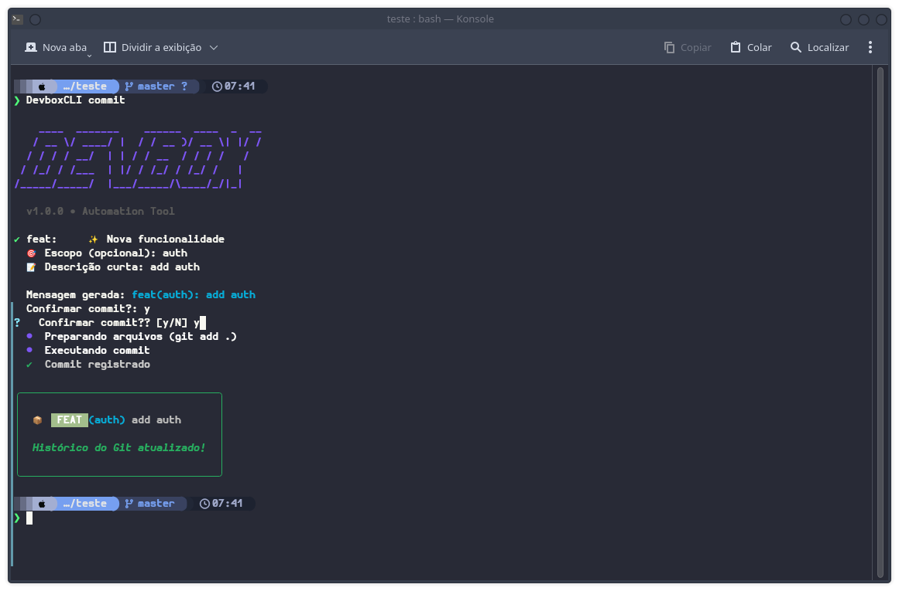

<div align="center">

# 📦 Devbox CLI

**Acelere seu desenvolvimento.**<br>
Crie projetos Backend e Frontend configurados com as melhores práticas<br>
(Clean Architecture, DDD, SOLID) em segundos.

  <p>
    
    
    
  </p>

  
  
  <br><br>

[**Instalar Agora**](#-instalação) • [**Como Usar**](#-como-usar) • [**Stacks**](#-stacks-suportadas)

</div>

---

## ✨ Por que usar o Devbox?

A **Devbox CLI** elimina a fadiga de configuração inicial (`git clone` de projetos velhos). Em vez de gastar horas configurando pastas, linters e Docker, inicie uma aplicação robusta com um comando.

<table>
  <tr>
    <td width="50%">
      <h3>🚀 Setup Instantâneo</h3>
      <p>Esqueça o boilerplate. Gere projetos completos com dependências instaladas e git inicializado automaticamente.</p>
    </td>
    <td width="50%">
      <h3>🏗️ Clean Architecture</h3>
      <p>Templates de Backend (Go/Python) já nascem com estrutura de <i>Domain-Driven Design</i> e separação de camadas.</p>
    </td>
  </tr>
  <tr>
    <td width="50%">
      <h3>🎨 Frontend Moderno</h3>
      <p>Integração nativa com <b>Vite</b> (React/TS) e <b>Next.js</b>, configurados com Tailwind e ESLint.</p>
    </td>
    <td width="50%">
      <h3>🩺 Devbox Doctor</h3>
      <p>O comando <code>doctor</code> verifica seu ambiente (Go, Node, Python, pnpm) e avisa o que falta instalar.</p>
    </td>
  </tr>
</table>

---

<hr>

## 🚀 como-usar

<table>
  <tr>
    <td width="30%"><b>Comando</b></td>
    <td><b>Descrição</b></td>
  </tr>
  <tr>
    <td><code>DevboxCLI init</code></td>
    <td>Inicia um novo projeto (Go, Node, Python, Ruby) com estrutura profissional.</td>
  </tr>
  <tr>
    <td><code>DevboxCLI add [tipo] [nome]</code></td>
    <td>Cria componentes (Controllers, Usecases) seguindo padrões de Clean Arch.</td>
  </tr>
  <tr>
    <td><code>DevboxCLI commit</code></td>
    <td>Wizard interativo para mensagens de commit padronizadas.</td>
  </tr>
  <tr>
    <td><code>DevboxCLI kill [porta]</code></td>
    <td>Localiza o PID e encerra o processo ocupando uma porta (ex: 8080).</td>
  </tr>
  <tr>
    <td><code>DevboxCLI config</code></td>
    <td>Gerencia preferências no arquivo ~/.devbox.yaml</td>
  </tr>
  <tr>
    <td><code>DevboxCLI doctor</code></td>
    <td>Verifica o estado das dependências instaladas na sua máquina.</td>
  </tr>
  <tr>
    <td><code>DevboxCLI cleanup</code></td>
    <td>Limpa <code>node_modules</code>, caches e binários para liberar espaço.</td>
  </tr>
</table>

<hr>

---

## 🛠️ Stacks Suportadas

### Backend

| Stack       | Variantes                  | Detalhes da Arquitetura                       |
| :---------- | :------------------------- | :-------------------------------------------- |
| **Go**      | `Clean Arch`, `Simple`     | `cmd/`, `internal/entity`, `internal/usecase` |
| **Python**  | `FastAPI`                  | `src/api`, `src/core`, `src/models`, `tests/` |
| **Node.js** | `TypeScript`, `JavaScript` | `src/controllers`, `src/routes`, `src/models` |
| **Ruby**    | `Simple`, `Rails`          | `app/controllers`, `app/routes`, `app/models` |

### Frontend

| Stack       | Detalhes                        |
| :---------- | :------------------------------ |
| **React**   | Via Vite (TypeScript + SWC)     |
| **Next.js** | App Router, TailwindCSS, ESLint |

---

## 🚀 Instalação

### Opção 1: Via Go Install (Recomendado)

Se você é desenvolvedor Go, esta é a maneira mais rápida:

```bash
go install [github.com/Samuteg/DevboxCLI@latest](https://github.com/Samuteg/DevboxCLI@latest)

```

---

### Opção 2: ### Via Script (Recomendado)

A maneira mais rápida de instalar no Linux ou macOS:

```bash
curl -sSL [https://raw.githubusercontent.com/Samuteg/DevboxCLI/main/install.sh](https://raw.githubusercontent.com/Samuteg/DevboxCLI/main/install.sh) | bash
```

---

## 📸 Demonstração Visual

<div align="center">
<p><b>Estrutura Dinâmica no comando <code>doctor</code></b></p>


<p><b>Interface do <code>commit</code> Wizard</b></p>

</div>

<div align="center">
<p>Desenvolvido com 💜 por <a href="https://www.google.com/search?q=https://github.com/Samuteg">Samuteg</a></p>

</div>
